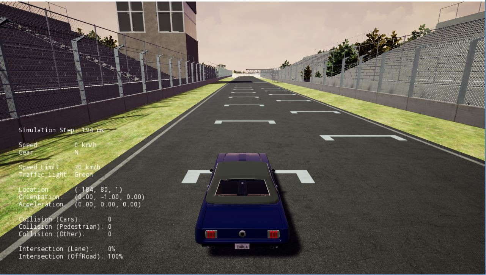
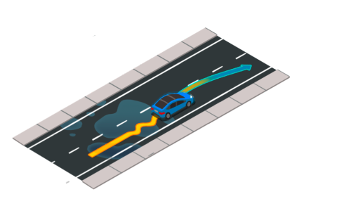
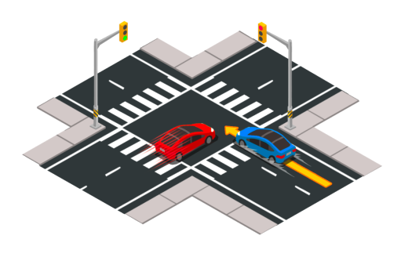
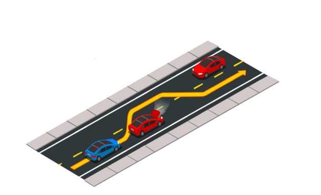
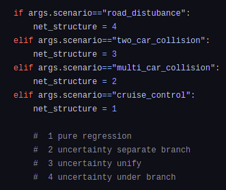
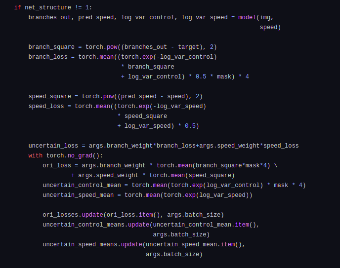

# Autonomous_Driving_in_CARLA

# Introduction:

We all know that world of automated systems are going to rule this world in coming times. So, here is our project on autonomous driving using Carla.

<h4>Dataset Used</h4>
We used the official dataset provide by <a href="https://github.com/carla-simulator/imitation-learning/">carla team</a>, which is of <B>24 GB</B> by size.
Dataset - <a href="https://drive.google.com/file/d/1hloAeyamYn-H6MfV1dRtY1gJPhkR55sY/view">link</a>

# Imitation Learning:

We used the method of Imitation learning to make the car an automated system in the given scenarios.

<table align="center">
  <tr>
    <td><B>Scene</B></td>
    <td><B>Sample Image</B></td>
  </tr>
  <tr>
    <td>Cruise Control</td>
    <td></td>
  </tr>
    <tr>
    <td>Road Disturbance</td>
    <td></td>
  </tr>
    <tr>
    <td>Dual Disturbance</td>
    <td></td>
  </tr>
    <tr>
    <td>Multiple Disturbance</td>
    <td></td>
  </tr>
</table>

<h4>Models architecture</h4>
We used four different models for this purpose, the models which one want to use can be control by the argument "--scenario" as shown below 
 

For model architcture, you can go this <a href ="https://github.com/AYUSH-ISHAN/Autonomous_Driving_in_CARLA/blob/main/carla_net.py">link</a>

<h4>Loss Function</h4>
We have defined loss function for scenario==1 as the Mean Squared Error loss for each branches, speed controller and uncertainity controller. While for other cases we did following as shown in image.

# Running the Code:

To run the code, bash this command on the terminal. You can change scenario as per your requirement.

                $ python main.py    
                --batch-size 1000
                --scenario cruise_control
                --workers 24
                --speed-weight 1
                --learning-rate 0.0001
                --lr-gamma 0.5
                --lr-step 10
                --train-dir "/path/to/the/training_data"
                --eval-dir "/path/to/the/eval_data"
                --gpu 0
                --id name_of_policy

Check the training log through tensorboard.

              $ tensorboard --logdir runs
                
